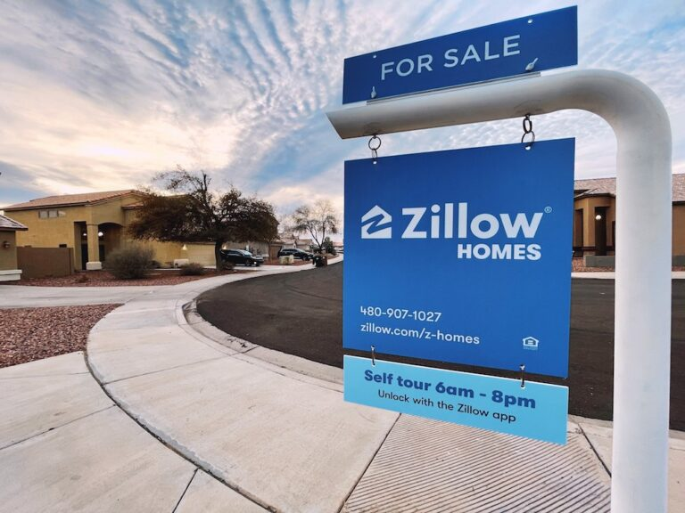

# Multiple Linear Regression: King County, WA Housing Analysis


**Authors**: Hoang Nguyen, Madoria Thomas, Marcelo Scatena

## Overview

The aim of this phase 2 project is to use an iterative approach in building stronger multiple linear regression model with King County, WA housing data. In our scenario, we are using the data to predict prices for a real estate company, Zillow. Through our modeling, we can determine key features that has a strong impact on home sales prices and provide Zillow recommendations based on our model. We created multiple models including a strong predictive model with a higher R-squared value and an inferential model to explain to our clients. 

***

## Business Problem

Zillow is interested in expanding their market to the King County region in Washington. They are looking for a model that can predict house prices to help them buy large quantity houses in the area. Our team plans to explore the data and build models that can help predict home prices in the region.




***

## Data

We are using a public data set from King County House Sales that was provided for us. The data set has 21597 rows and 21 columns for homes sold in 2014 and 2015. 

***

## Methods

We used an iterative model approach where we made alterations in a multi step process while comparing the improvements over each step. We began by splitting the data set into a training and testing set of data. Throughout the process, we created a function everytime we transformed the training data so that we could quickly apply it on the testing data. 

We built and compared the following models and made the following step-wise alterations to them:
1) Baseline model with one feature variable
2) Model with all features
3) Data cleaning and removing outliers
4) Addressing multicolinearity
5) Feature engineering
6) Narrowing down the features to ones that have a substantial correlation coefficient. 
7) Log transformation to address assumptions


***

## Results

* When comparing our baseline model we see.... with improvements in....
Our best R squared value was.... and RMS was...


Our final model was predictive model was....


Our final iterative model was...


This means if everything is held constant.....


## Conclusions

Given all the information we gathered and visualized, our Key recommendations are the following:

- **Use our model to help predict house prices.**
- **Waterfront and View has a large impact on prices. If Zillow is interested in buying many homes, avoid homes with these features.** 
- **Homes closer to Seattle and Redmond more expenisve. If Zillow is interested in just buying many homes, look around Kent for cheaper homes.**
- **Examine the houses and see what home buyers value to add to the model, such as fireplaces.**

***

## For More Information

Please review our full analysis in [our Jupyter Notebook](./dsc-phase2-project.ipynb) or our [presentation](./dsc-phase2-presentation.pdf).

For any additional questions, please contact<br />
**Hoang Nguyen: hvnguyen90@gmail.com**<br />
**Madoria Thomas: deaudrey011@hotmail.com**<br />
**Marcelo Scatena: marcelo.oddo@gmail.com**<br />

## Repository Structure


```
├── README.md                           
├── dsc-phase2-project-template.ipynb   
├── DS_Project_Presentation.pdf         
├── data                                
└── images                              
```
