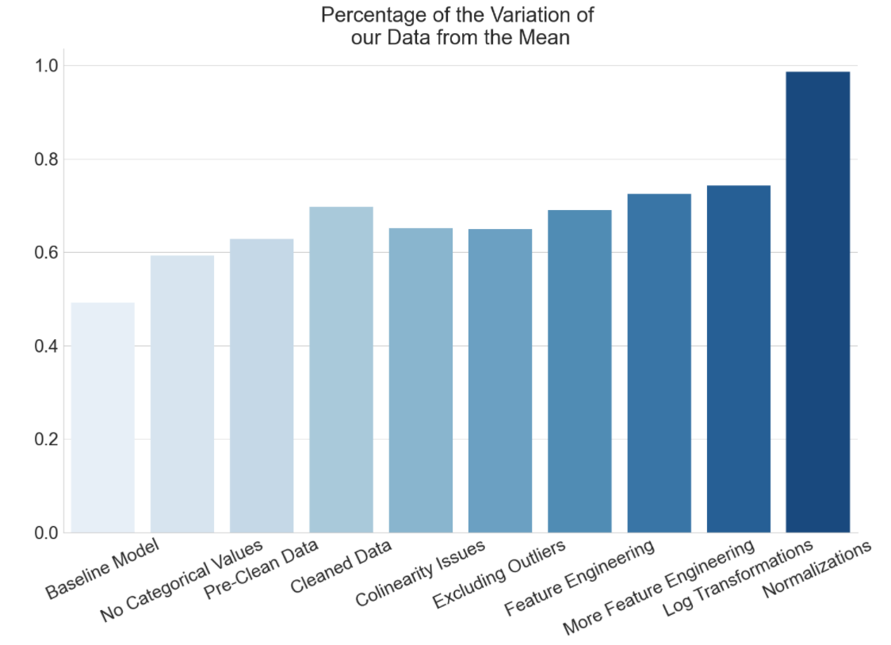
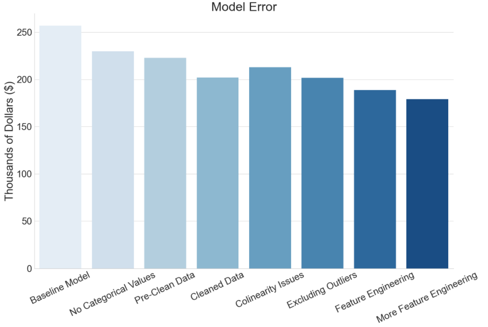
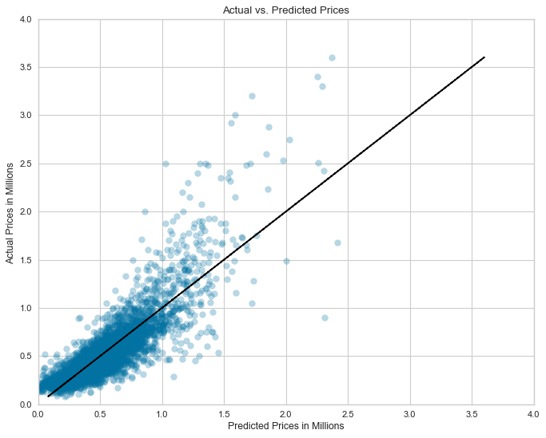
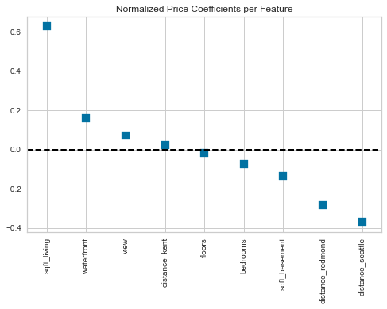
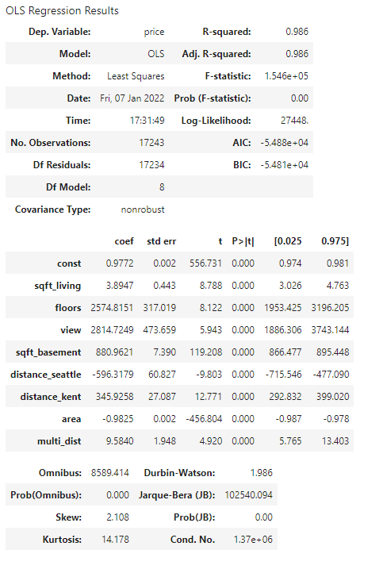

# Multiple Linear Regression: King County, WA Housing Analysis


**Authors**: Hoang Nguyen, Madoria Thomas, Marcelo Scatena

## Overview

The aim of this phase 2 project is to use an iterative approach in building stronger multiple linear regression model with King County, WA housing data. In our scenario, we are using the data to predict prices for a real estate company, Zillow. Through our modeling, we can determine key features that has a strong impact on home sales prices and provide Zillow recommendations based on our model. We created multiple models including a strong predictive model with a higher R-squared value and an inferential model to explain to our clients. 

***

## Business Problem

Zillow is interested in expanding their market to the King County region in Washington. They are looking for a model that can predict house prices to help them buy large quantity houses in the area. Our team plans to explore the data and build models that can help predict home prices in the region.


***

## Data

We are using a public data set from King County House Sales that was provided for us. The data set has 21597 rows and 21 columns for homes sold in 2014 and 2015. 

***

## Methods

We used an iterative model approach where we made alterations in a multi step process while comparing the improvements over each step. We began by splitting the data set into a training and testing set of data. Throughout the process, we created a function everytime we transformed the training data so that we could quickly apply it on the testing data. 

We built and compared the following models and made the following step-wise alterations to them:
1) Baseline model with one feature variable
2) Model with no categorical values
3) Model pre-cleaned
4) Model after cleaning 
5) Model addressing colinearity
6) Model excluding outliers
7) Model with engineered features
8) Engineered more features (Our Inferential model)
9) Log transformations
10) Normalizations (Our best predictive model)


***

## Results

Our best predictive model had an R-squared of 0.986 which is a big improvement of our baseline model's R-squared of 0.492.




Our inferential model had R-squared of 0.725 and a RMSE of $178957. This error was a big improvement over the baseline's model error of $256860.  



Plotting the residuals with our predictive model against our test data. We saw that it explained 72.5% of the variance. We also noticed that there was much larger variance with the more expensive homes. This is usable for our business situation since the client is interested in buying cheaper homes which our model seems to be better at predicting.



We examined our model coefficients to see which ones played a larger role in affecting price. This means that for this model, if everything else is held constant, if we were to increase sqft_living by one unit, the housing price would increase by $284.76.


We normalized the coefficients affecting house price to get a better idea of how each feature is impacting house price. Before normalizing our data, we see that sqft_living had one of the smaller coefficients. However, after normalizing the features, it shows that sqft_living has relatively one of the biggest impact on house prices. We believe that these are key housing features that we should pay attention to for prediction house prices.



Our best predictive model invovled many transformations with the addition of engineered features that can be found in our notebook. 




## Conclusions

Given all the information we gathered and visualized, our Key recommendations are the following:

- **Use our model to help predict house prices.**
- **Waterfront and View has a large impact on prices. If Zillow is interested in buying many homes, avoid homes with these features.** 
- **Homes closer to Seattle and Redmond more expenisve. If Zillow is interested in buying many homes, look around Kent for cheaper homes.**
- **Examine the houses and see what home buyers value to add to the model, such as fireplaces.**

***

## For More Information

Please review our full analysis in [our Jupyter Notebook](./Master.ipynb) or our [presentation](./Presentation.pdf).

For any additional questions, please contact<br />
**Hoang Nguyen: hvnguyen90@gmail.com**<br />
**Madoria Thomas: deaudrey011@hotmail.com**<br />
**Marcelo Scatena: marcelo.oddo@gmail.com**<br />

## Repository Structure


```
├── README.md                           
├── Master.ipynb   
├── Presentation.pdf         
├── data                                
└── images                              
```
